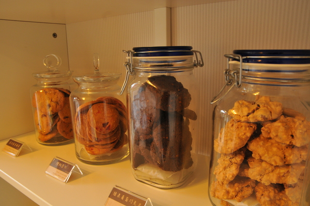

# Bottler &nbsp;[](https://travis-ci.org/emoji-gen/bottler) [](https://codecov.io/gh/emoji-gen/bottler)

:cookie: Cookie serializer and deserializer library for Java.



## Getting Started
Please type it in your build.gradle file.

```groovy
repositories {
    jcenter()
}

dependencies {
    compile 'moe.pine:bottler:0.1.0'
}
```

## Usage

```java
CookieManager manager = CookieManager.getInstance();
CookieStore store = manager.getCookieStore();

ByteArrayOutputStream os = new ByteArrayOutputStream();
CookieStoreUtils.writeTo(store, os); // Save!

store.removeAll();

ByteArrayInputStream is = new ByteArrayInputStream(os.toByteArray());
CookieStoreUtils.readFrom(store, is); // Restore!!
```

## Test

```
$ ./gradlew clean check
```

## License
MIT &copy; [Emoji Generator](https://emoji.pine.moe/)
